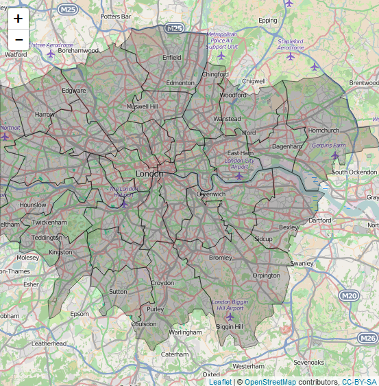

London Crime Rates
========================================================
author: Grace Pehl, PhD
date: September 27, 2015

View the app at the [shiny apps](https://gracepehl.shinyapps.io/LondonMap) site.


Data Wrangling
========================================================
type: pehl

- London crime data and population data came from the [London Data Store](http://data.london.gov.uk/dataset).

- I used the dplyr package to summarize crime by category and borough (neighborhood) and calculate the rate based the population of each borough.

- Spatial data came from Robin Lovelace's [spatial information in R](https://github.com/Robinlovelace/Creating-maps-in-R) tutorial.

Spatial Data in R
========================================================
R stores spatial information in an S4 dataframe


```r
# df@data acts like a typical dataframe
df@bbox # the lat/long of the bounding box
```

```
         min        max
x -0.5103395  0.3338729
y 51.2867601 51.6918477
```

```r
df@proj4string # the map projection
```

```
CRS arguments:
 +init=epsg:4326 +proj=longlat +datum=WGS84 +no_defs +ellps=WGS84
+towgs84=0,0,0 
```

Making Maps with Leaflet
========================================================

```r
leaflet(data=london) %>%
    addTiles() %>%
    addPolygons(
        color="black",
        weight = 1)
```
***


Data Analysis Results
========================================================
type: pehl

* The crime rate for the London borough of Westminster is much higher than the rest of London.

* Separating the crime rates by category reveals that most of the variation is in the rate of Theft & Handling crimes.

* Westminster is the tourist district of London, so there are far more people there then the resident population used to compute the rate.  The presence of tourists also draws more pick-pocket types of theft.
